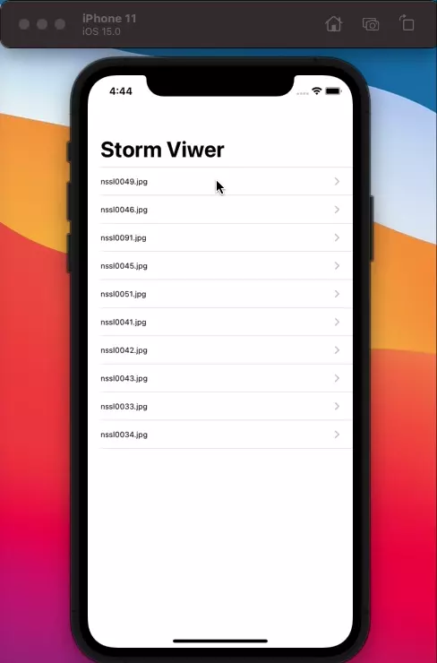

# StormViwer
A gallery to display images included in the app's internal assets folder.

This is my first ever swift project and it is a part of the series [100 Days of Swift](https://www.hackingwithswift.com/100/), from [HackingWithSwift.com](https://www.hackingwithswift.com).

## Demo (.webp)

